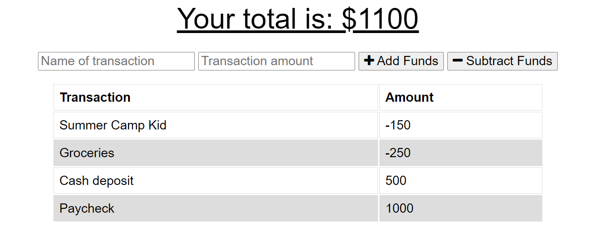
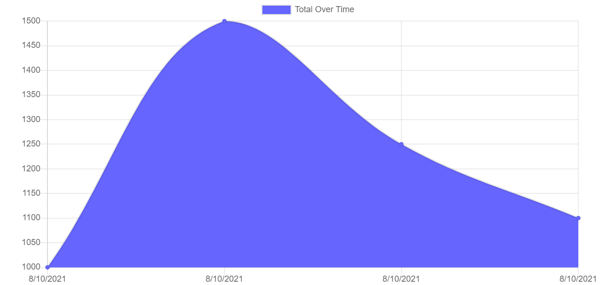

# BudgetTracker

The task is to add functionality to an existing Budget Tracker application to allow for offline access and functionality.

## Description

The BudgetTracker give users a fast and easy way to track their money by allowing them to access the information anytime even without any internet connection.

## Technologies Used

* `Node.js`
* `npm (Node Package Manager)`
* `Javascript`
* `MongoDB Atlas`
* `Express.js`
* `Mongoose`
* `Compression`
* `Morgan`
* `IndexedDB`


## User Story

```md
As an avid traveller
I want to be able to track my withdrawals and deposits with or without a data/internet connection
so that my account balance is accurate when I am traveling.

```

## Acceptance Criteria

```md

Given a user is on budget App without an internet connection
When the user inputs a withdrawal or deposit
Then that will be shown on the page, and added to their transaction history when their connection is back online.
```

## Application Screenshots





## Application Links
* [Github](https://github.com/AlCharl88/BudgetTracker)
* [Heroku Live Deployment](https://warm-lake-26156.herokuapp.com/)

## Contact 

Alain Tagne - [Github](https://github.com/AlCharl88) Email: [Alain](mailto:alctagne@gmail.com) 

---

&copy; 2021 Alain Tagne